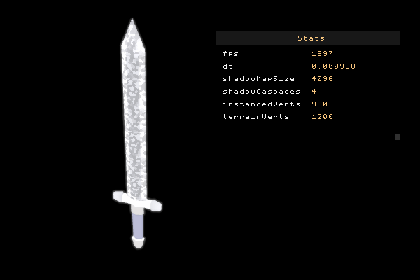

# portfolio 

C++ 3D framework / engine from scratch (little use of third party tools).
**Intended to show my experience with C++ programming and software engineering.**
It is not intended to be a "plug in and play" library nor is it an universal 3D engine.

for more images head to ads/progress/

## Contents
- custom resource parsing (custom mesh file (python blender export), custom prefabs file)
- data-oriented ecs
- window and input system
- elaborated vulkan renderer (materials, instancing, shadowmaps, postfx, state management)
- serialization of terrain and ecs data (save/load)
- immediate-style UI and text rendering
- containers (little use of STL facilities)
- block memory allocation (with some CTFE)
- maths library (matrix, algorithms)
- logger, profiling, other utils
- editor (undo/redo commands) and basic scene tree

some very basic sketches:

## How to run?
- I am using VS Code with some C++ extensions
- Batch files are included to fire up the compiler (mingw GCC)
- Need of C++20 (heavy use of "designated initializers" for Vulkan)

## Code Style
More c-style based programming with less usage of common OOP features
(like inheritance, encapsulation with access modifiers) 

## Vulkan
- Context  (Instance, PhysicalDevice, LogicalDevice, Swapchain)
- Objects  (Buffer, Image, Descriptors)
- States   ("dedicated structs" per state)
- Renderer (Presentation, synoptic)

Files in ext/ directory are licensed separately, please view these files for more information.
