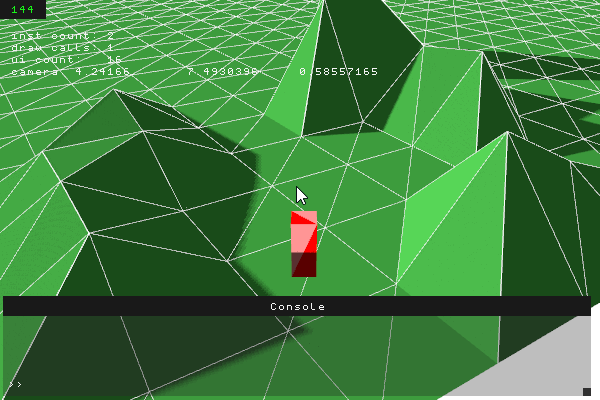

# mini
Base framework for my games, ui and multimedia projects. 
Intended to show my experience with programming in C++ and software engineering.
It is not intended to be a "plug in and play" library. 

### Contents
- Custom STL (Array, String, Bitset, Maps)
- Memory allocation (some CTFE)
- Logger and profiler (HTML memory print out)
- Math and algorithms (Matrix, Quaternion)
- Window and input event system
- Vulkan renderer (3D, terrain, player controller, shadows) and immediate GUI
- Other utils

This is Work In Progress! 

## How to run?
- I am using VS Code with some C++ extensions
- Batch files are included to fire up the compiler MSVC
- Need of C++20 (heavy use of "designated initializers" for Vulkan)

# Rationale

## Custom STL
The std is hard to read and hard to extend (e.g. using std::vector with custom allocator).
So I decided to roll my own containers and memory allocation.

## Entity-Component-System
- DOD (SOA)
- Custom parsing from txt file (prefabs)

## Vulkan
General structure:
- Context   (Instance, PhysicalDevice, LogicalDevice, Meta, Debug)
- Resources (Pipeline, Shader, Renderpass, Synchronization, ...)
- Rendering (Command recording, presentation loop)
- Wrappers
- Custom parsing of mesh data (custom blender export)

Files in third/ directory are licensed separately, please view these files for more information.